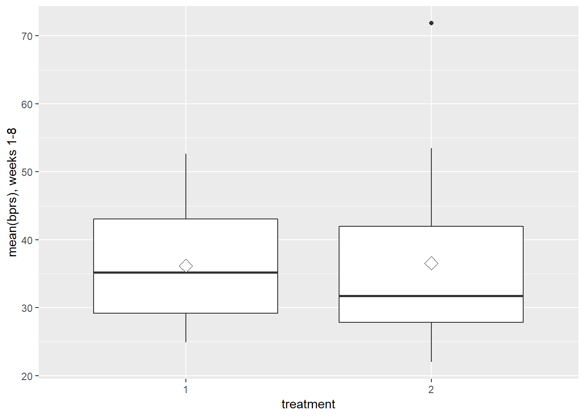

# Analysis of longitudinal data


I started first with the Brief Psychiatric Rating Scale (BPRS) data. It contains 40 rows and 11 columns. This data is one of several tools that help researchers study people with schizophrenia and related psychotic disorders. 

```r
dim(BPRS)
```

```
## [1] 40 11
```

```r
names(BPRS)
```

```
##  [1] "treatment" "subject"   "week0"     "week1"     "week2"    
##  [6] "week3"     "week4"     "week5"     "week6"     "week7"    
## [11] "week8"
```

```r
head(BPRS)
```

```
##   treatment subject week0 week1 week2 week3 week4 week5 week6 week7 week8
## 1         1       1    42    36    36    43    41    40    38    47    51
## 2         1       2    58    68    61    55    43    34    28    28    28
## 3         1       3    54    55    41    38    43    28    29    25    24
## 4         1       4    55    77    49    54    56    50    47    42    46
## 5         1       5    72    75    72    65    50    39    32    38    32
## 6         1       6    48    43    41    38    36    29    33    27    25
```

```r
str(BPRS)
```

```
## 'data.frame':	40 obs. of  11 variables:
##  $ treatment: int  1 1 1 1 1 1 1 1 1 1 ...
##  $ subject  : int  1 2 3 4 5 6 7 8 9 10 ...
##  $ week0    : int  42 58 54 55 72 48 71 30 41 57 ...
##  $ week1    : int  36 68 55 77 75 43 61 36 43 51 ...
##  $ week2    : int  36 61 41 49 72 41 47 38 39 51 ...
##  $ week3    : int  43 55 38 54 65 38 30 38 35 55 ...
##  $ week4    : int  41 43 43 56 50 36 27 31 28 53 ...
##  $ week5    : int  40 34 28 50 39 29 40 26 22 43 ...
##  $ week6    : int  38 28 29 47 32 33 30 26 20 43 ...
##  $ week7    : int  47 28 25 42 38 27 31 25 23 39 ...
##  $ week8    : int  51 28 24 46 32 25 31 24 21 32 ...
```

```r
summary(BPRS)
```

```
##    treatment      subject          week0           week1      
##  Min.   :1.0   Min.   : 1.00   Min.   :24.00   Min.   :23.00  
##  1st Qu.:1.0   1st Qu.: 5.75   1st Qu.:38.00   1st Qu.:35.00  
##  Median :1.5   Median :10.50   Median :46.00   Median :41.00  
##  Mean   :1.5   Mean   :10.50   Mean   :48.00   Mean   :46.33  
##  3rd Qu.:2.0   3rd Qu.:15.25   3rd Qu.:58.25   3rd Qu.:54.25  
##  Max.   :2.0   Max.   :20.00   Max.   :78.00   Max.   :95.00  
##      week2          week3           week4           week5      
##  Min.   :26.0   Min.   :24.00   Min.   :20.00   Min.   :20.00  
##  1st Qu.:32.0   1st Qu.:29.75   1st Qu.:28.00   1st Qu.:26.00  
##  Median :38.0   Median :36.50   Median :34.50   Median :30.50  
##  Mean   :41.7   Mean   :39.15   Mean   :36.35   Mean   :32.55  
##  3rd Qu.:49.0   3rd Qu.:44.50   3rd Qu.:43.00   3rd Qu.:38.00  
##  Max.   :75.0   Max.   :76.00   Max.   :66.00   Max.   :64.00  
##      week6           week7          week8      
##  Min.   :19.00   Min.   :18.0   Min.   :20.00  
##  1st Qu.:22.75   1st Qu.:23.0   1st Qu.:22.75  
##  Median :28.50   Median :30.0   Median :28.00  
##  Mean   :31.23   Mean   :32.2   Mean   :31.43  
##  3rd Qu.:37.00   3rd Qu.:38.0   3rd Qu.:35.25  
##  Max.   :64.00   Max.   :62.0   Max.   :75.00
```
The summary of the data shows that 40 male subjects were randomly assigned to one of two treatment groups and each subject was rated on the BPRS measured before treatment began (week 0) and then at weekly intervals for eight weeks. The BPRS assesses the level of 18 symptom constructs such as hostility, suspiciousness, hallucinations and grandiosity; each of these is rated from one (not present) to seven (extremely severe).

Now we are factoring two variables 'Treatment' and 'Subject' and converting the data into long form. Then we extracted the week numbers from the data.


```r
glimpse(BPRSL)
```

```
## Observations: 360
## Variables: 5
## $ treatment <fct> 1, 1, 1, 1, 1, 1, 1, 1, 1, 1, 1, 1, 1, 1, 1, 1, 1, 1...
## $ subject   <fct> 1, 2, 3, 4, 5, 6, 7, 8, 9, 10, 11, 12, 13, 14, 15, 1...
## $ weeks     <chr> "week0", "week0", "week0", "week0", "week0", "week0"...
## $ bprs      <int> 42, 58, 54, 55, 72, 48, 71, 30, 41, 57, 30, 55, 36, ...
## $ week      <int> 0, 0, 0, 0, 0, 0, 0, 0, 0, 0, 0, 0, 0, 0, 0, 0, 0, 0...
```

Now we are plotting the results  after converting the data into long form. 

```r
ggplot(BPRSL, aes(x = week, y = bprs, linetype = subject, color = subject)) +
  geom_line() +
  scale_linetype_manual(values = rep(1:10, times=4)) +
  facet_grid(. ~ treatment, labeller = label_both) +
  theme(legend.position = "right") + 
  scale_y_continuous(limits = c(min(BPRSL$bprs), max(BPRSL$bprs)))
```


The plot shows BPRS values for all 40 men, differentiating between the treatment groups into which the men have been randomized. This simple graph makes a number of features of the data readily apparent.

An important effect we want to take notice is how the men who have higher BPRS values at the beginning tend to have higher values throughout the study. 
For this purpose we use stadardised values to observe the tracking from beginning to throughout the period.


```r
BPRSL <- BPRSL %>%
  group_by(week) %>%
  mutate(stdbprs = (bprs - mean(bprs))/sd(bprs) ) %>%
  ungroup()
```


```r
glimpse(BPRSL)
```

```
## Observations: 360
## Variables: 6
## $ treatment <fct> 1, 1, 1, 1, 1, 1, 1, 1, 1, 1, 1, 1, 1, 1, 1, 1, 1, 1...
## $ subject   <fct> 1, 2, 3, 4, 5, 6, 7, 8, 9, 10, 11, 12, 13, 14, 15, 1...
## $ weeks     <chr> "week0", "week0", "week0", "week0", "week0", "week0"...
## $ bprs      <int> 42, 58, 54, 55, 72, 48, 71, 30, 41, 57, 30, 55, 36, ...
## $ week      <int> 0, 0, 0, 0, 0, 0, 0, 0, 0, 0, 0, 0, 0, 0, 0, 0, 0, 0...
## $ stdbprs   <dbl> -0.4245908, 0.7076513, 0.4245908, 0.4953559, 1.69836...
```


```r
ggplot(BPRSL, aes(x = week, y = stdbprs, linetype = subject, color=subject)) +
  geom_line() +
  scale_linetype_manual(values = rep(1:10, times=4)) +
  facet_grid(. ~ treatment, labeller = label_both) +
  scale_y_continuous(name = "standardized bprs")
```


Now we are summarizing data with the mean and standard error


```r
glimpse(BPRSS)
```

```
## Observations: 18
## Variables: 4
## $ treatment <fct> 1, 1, 1, 1, 1, 1, 1, 1, 1, 2, 2, 2, 2, 2, 2, 2, 2, 2
## $ week      <int> 0, 1, 2, 3, 4, 5, 6, 7, 8, 0, 1, 2, 3, 4, 5, 6, 7, 8
## $ mean      <dbl> 47.00, 46.80, 43.55, 40.90, 36.60, 32.70, 29.70, 29....
## $ se        <dbl> 4.534468, 5.173708, 4.003617, 3.744626, 3.259534, 2....
```

Now we will look into the post treatment values of the BPRS. The mean of weeks 1 to 8 will be our summary measure.


```r
ggplot(BPRSS, aes(x = week, y = mean, linetype = treatment, shape = treatment)) +
  geom_line() +
  scale_linetype_manual(values = c(1,2)) +
  geom_point(size=3) +
  scale_shape_manual(values = c(1,2)) +
  theme(legend.position = c(0.8,0.8)) +
  scale_y_continuous(name = "mean(bprs) +/- se(bprs)")
```


```r
ggplot(BPRSS, aes(x = week, y = mean, linetype = treatment, shape = treatment)) +
  geom_line() +
  scale_linetype_manual(values = c(1,2)) +
  geom_point(size=3) +
  scale_shape_manual(values = c(1,2)) +
  geom_errorbar(aes(ymin=mean-se, ymax=mean+se, linetype="1"), width=0.3) +
  theme(legend.position = c(0.8,0.8)) +
  scale_y_continuous(name = "mean(bprs) +/- se(bprs)")
```


If we look at the results, they state that the mean summary measure is more variable in the second treatment group and its distribution in this group is somewhat skew.

```r
BPRSL8S <- BPRSL %>%
  filter(week > 0) %>%
  group_by(treatment, subject) %>%
  summarise( mean=mean(bprs) ) %>%
  ungroup()
```


```r
glimpse(BPRSL8S)
```

```
## Observations: 40
## Variables: 3
## $ treatment <fct> 1, 1, 1, 1, 1, 1, 1, 1, 1, 1, 1, 1, 1, 1, 1, 1, 1, 1...
## $ subject   <fct> 1, 2, 3, 4, 5, 6, 7, 8, 9, 10, 11, 12, 13, 14, 15, 1...
## $ mean      <dbl> 41.500, 43.125, 35.375, 52.625, 50.375, 34.000, 37.1...
```


```r
ggplot(BPRSL8S, aes(x = treatment, y = mean)) +
  geom_boxplot() +
  stat_summary(fun.y = "mean", geom = "point", shape=23, size=4, fill = "white") +
  scale_y_continuous(name = "mean(bprs), weeks 1-8")
```



Now we are creating a new dataset by filtering out the mean BPRS score of the eight weeks when it is over 70. It might bias the conclusions from further comparisons of the groups, so we are removing that subject from the data to better understand the results without any bias.

We are fitting linear model on baseline as week 0 and treatment against the mean of the treatment as targhet.

```r
BPRSL8S1 <- BPRSL8S %>%filter(mean < 70) 
t.test(mean ~ treatment, data = BPRSL8S1, var.equal = TRUE)
```

```
## 
## 	Two Sample t-test
## 
## data:  mean by treatment
## t = 0.52095, df = 37, p-value = 0.6055
## alternative hypothesis: true difference in means is not equal to 0
## 95 percent confidence interval:
##  -4.232480  7.162085
## sample estimates:
## mean in group 1 mean in group 2 
##        36.16875        34.70395
```

```r
BPRSL8S2 <- BPRSL8S %>%
  mutate(baseline = BPRS$week0)

fit <- lm(mean ~ BPRSL8S2$baseline + BPRSL8S2$treatment, data = BPRSL8S2)

anova(fit)
```

```
## Analysis of Variance Table
## 
## Response: mean
##                    Df  Sum Sq Mean Sq F value    Pr(>F)    
## BPRSL8S2$baseline   1 1868.07 1868.07 30.1437 3.077e-06 ***
## BPRSL8S2$treatment  1    3.45    3.45  0.0557    0.8148    
## Residuals          37 2292.97   61.97                      
## ---
## Signif. codes:  0 '***' 0.001 '**' 0.01 '*' 0.05 '.' 0.1 ' ' 1
```
We can see that the baseline BPRS is strongly related to the BPRS values taken after treatment has begun, but there is still no evidence of a treatment difference even after conditioning on the baseline value

Now in this part of the exercise we are analysing the longitudinal data. In the Longitudinal data, a response variable is measured on each subject on several different occasions poses problems for their analysis because the repeated measurements on each subject are very likely to be correlated rather than independent.

we are using data from a nutrition study conducted in three groups of rats. The groups were put on different diets, and each animal's body weight (grams) was recorded repeatedly (approximately) weekly, except in week seven when two recordings were taken) over a 9-week period. The question of most interest is whether the growth profiles of the three groups differ.


```r
names(RATS)
```

```
##  [1] "ID"    "Group" "WD1"   "WD8"   "WD15"  "WD22"  "WD29"  "WD36" 
##  [9] "WD43"  "WD44"  "WD50"  "WD57"  "WD64"
```

```r
dim(RATS)
```

```
## [1] 16 13
```

```r
str(RATS)
```

```
## 'data.frame':	16 obs. of  13 variables:
##  $ ID   : int  1 2 3 4 5 6 7 8 9 10 ...
##  $ Group: int  1 1 1 1 1 1 1 1 2 2 ...
##  $ WD1  : int  240 225 245 260 255 260 275 245 410 405 ...
##  $ WD8  : int  250 230 250 255 260 265 275 255 415 420 ...
##  $ WD15 : int  255 230 250 255 255 270 260 260 425 430 ...
##  $ WD22 : int  260 232 255 265 270 275 270 268 428 440 ...
##  $ WD29 : int  262 240 262 265 270 275 273 270 438 448 ...
##  $ WD36 : int  258 240 265 268 273 277 274 265 443 460 ...
##  $ WD43 : int  266 243 267 270 274 278 276 265 442 458 ...
##  $ WD44 : int  266 244 267 272 273 278 271 267 446 464 ...
##  $ WD50 : int  265 238 264 274 276 284 282 273 456 475 ...
##  $ WD57 : int  272 247 268 273 278 279 281 274 468 484 ...
##  $ WD64 : int  278 245 269 275 280 281 284 278 478 496 ...
```

```r
RATS$ID <- factor(RATS$ID)
RATS$Group <- factor(RATS$Group)

glimpse(RATS)
```

```
## Observations: 16
## Variables: 13
## $ ID    <fct> 1, 2, 3, 4, 5, 6, 7, 8, 9, 10, 11, 12, 13, 14, 15, 16
## $ Group <fct> 1, 1, 1, 1, 1, 1, 1, 1, 2, 2, 2, 2, 3, 3, 3, 3
## $ WD1   <int> 240, 225, 245, 260, 255, 260, 275, 245, 410, 405, 445, 5...
## $ WD8   <int> 250, 230, 250, 255, 260, 265, 275, 255, 415, 420, 445, 5...
## $ WD15  <int> 255, 230, 250, 255, 255, 270, 260, 260, 425, 430, 450, 5...
## $ WD22  <int> 260, 232, 255, 265, 270, 275, 270, 268, 428, 440, 452, 5...
## $ WD29  <int> 262, 240, 262, 265, 270, 275, 273, 270, 438, 448, 455, 5...
## $ WD36  <int> 258, 240, 265, 268, 273, 277, 274, 265, 443, 460, 455, 5...
## $ WD43  <int> 266, 243, 267, 270, 274, 278, 276, 265, 442, 458, 451, 5...
## $ WD44  <int> 266, 244, 267, 272, 273, 278, 271, 267, 446, 464, 450, 5...
## $ WD50  <int> 265, 238, 264, 274, 276, 284, 282, 273, 456, 475, 462, 6...
## $ WD57  <int> 272, 247, 268, 273, 278, 279, 281, 274, 468, 484, 466, 6...
## $ WD64  <int> 278, 245, 269, 275, 280, 281, 284, 278, 478, 496, 472, 6...
```

To study the diffecences between the variable of interest, that is the weight of the individual rats, and the groups as well as the change of the weight in time, we want to gather the data to a long form.

We are extracting the number of days as an integer variable.


```r
dim(RATSL)
```

```
## [1] 176   5
```

```r
glimpse(RATSL)
```

```
## Observations: 176
## Variables: 5
## $ ID     <fct> 1, 2, 3, 4, 5, 6, 7, 8, 9, 10, 11, 12, 13, 14, 15, 16, ...
## $ Group  <fct> 1, 1, 1, 1, 1, 1, 1, 1, 2, 2, 2, 2, 3, 3, 3, 3, 1, 1, 1...
## $ WD     <chr> "WD1", "WD1", "WD1", "WD1", "WD1", "WD1", "WD1", "WD1",...
## $ Weight <int> 240, 225, 245, 260, 255, 260, 275, 245, 410, 405, 445, ...
## $ Time   <int> 1, 1, 1, 1, 1, 1, 1, 1, 1, 1, 1, 1, 1, 1, 1, 1, 8, 8, 8...
```

We are just using the simple plot to see how the data looks like in visual form before starting any wrangling of the data to get a better understanding. 


```r
ggplot(RATSL, aes(x = Time, y = Weight, group = ID, color = Group)) +
  geom_line(aes(linetype = Group)) + 
  scale_x_continuous(name = "Time (days)", breaks = seq(0,60,10)) + 
  scale_y_continuous (name = "Weight(grams)") +
  theme(legend.position = "top")
```


Now we will fit a multiple linear regression model with weight as response and Time and Group as explanatory variables. We will see the summary of the model then.


```r
RATS_reg <- lm(Weight ~ Time + Group, data=RATSL)
summary(RATS_reg)
```

```
## 
## Call:
## lm(formula = Weight ~ Time + Group, data = RATSL)
## 
## Residuals:
##     Min      1Q  Median      3Q     Max 
## -60.643 -24.017   0.697  10.837 125.459 
## 
## Coefficients:
##             Estimate Std. Error t value Pr(>|t|)    
## (Intercept) 244.0689     5.7725  42.281  < 2e-16 ***
## Time          0.5857     0.1331   4.402 1.88e-05 ***
## Group2      220.9886     6.3402  34.855  < 2e-16 ***
## Group3      262.0795     6.3402  41.336  < 2e-16 ***
## ---
## Signif. codes:  0 '***' 0.001 '**' 0.01 '*' 0.05 '.' 0.1 ' ' 1
## 
## Residual standard error: 34.34 on 172 degrees of freedom
## Multiple R-squared:  0.9283,	Adjusted R-squared:  0.9271 
## F-statistic: 742.6 on 3 and 172 DF,  p-value: < 2.2e-16
```

The summary shows that the model assumes independence of the repeated measures of weight, and this assumption is highly unlikely. So we will move on to consider some more appropriate graphics and appropriate models. 
To begin the more formal analysis of the rat growth data, we will first fit the random intercept model for the same two explanatory variables: Time and Group. Fitting a random intercept model allows the linear regression fit for each rat to differ in intercept from other rats.


```r
RATS_ref <- lmer(Weight ~ Time + Group + (1 | ID), data = RATSL, REML = FALSE)

print(RATS_ref)
```

```
## Linear mixed model fit by maximum likelihood  ['lmerMod']
## Formula: Weight ~ Time + Group + (1 | ID)
##    Data: RATSL
##       AIC       BIC    logLik  deviance  df.resid 
## 1333.1639 1352.1868 -660.5819 1321.1639       170 
## Random effects:
##  Groups   Name        Std.Dev.
##  ID       (Intercept) 32.953  
##  Residual              8.151  
## Number of obs: 176, groups:  ID, 16
## Fixed Effects:
## (Intercept)         Time       Group2       Group3  
##    244.0689       0.5857     220.9886     262.0795
```

Now we will move on to fit the random intercept and random slope model to the rat growth data. Fitting a random intercept and random slope model allows the linear regression fits for each individual to differ in intercept but also in slope. This way it is possible to account for the individual differences in the rats' growth profiles, but also the effect of time.


```r
RATS_ref1 <- lmer(Weight ~ Time + Group + (Time | ID), data = RATSL, REML = FALSE)


print(RATS_ref1)
```

```
## Linear mixed model fit by maximum likelihood  ['lmerMod']
## Formula: Weight ~ Time + Group + (Time | ID)
##    Data: RATSL
##       AIC       BIC    logLik  deviance  df.resid 
## 1194.2189 1219.5828 -589.1095 1178.2189       168 
## Random effects:
##  Groups   Name        Std.Dev. Corr 
##  ID       (Intercept) 33.7718       
##           Time         0.3349  -0.22
##  Residual              4.4436       
## Number of obs: 176, groups:  ID, 16
## Fixed Effects:
## (Intercept)         Time       Group2       Group3  
##    246.4573       0.5857     214.5874     258.9273
```

```r
anova(RATS_ref1, RATS_ref)
```

```
## Data: RATSL
## Models:
## RATS_ref: Weight ~ Time + Group + (1 | ID)
## RATS_ref1: Weight ~ Time + Group + (Time | ID)
##           Df    AIC    BIC  logLik deviance  Chisq Chi Df Pr(>Chisq)    
## RATS_ref   6 1333.2 1352.2 -660.58   1321.2                             
## RATS_ref1  8 1194.2 1219.6 -589.11   1178.2 142.94      2  < 2.2e-16 ***
## ---
## Signif. codes:  0 '***' 0.001 '**' 0.01 '*' 0.05 '.' 0.1 ' ' 1
```


```r
RATS_ref2 <- lmer(Weight ~ Time * Group + (Time | ID), data = RATSL, REML = FALSE)


summary(RATS_ref2)
```

```
## Linear mixed model fit by maximum likelihood  ['lmerMod']
## Formula: Weight ~ Time * Group + (Time | ID)
##    Data: RATSL
## 
##      AIC      BIC   logLik deviance df.resid 
##   1185.9   1217.6   -582.9   1165.9      166 
## 
## Scaled residuals: 
##     Min      1Q  Median      3Q     Max 
## -3.2669 -0.4249  0.0726  0.6034  2.7513 
## 
## Random effects:
##  Groups   Name        Variance  Std.Dev. Corr 
##  ID       (Intercept) 1.107e+03 33.2763       
##           Time        4.925e-02  0.2219  -0.15
##  Residual             1.975e+01  4.4436       
## Number of obs: 176, groups:  ID, 16
## 
## Fixed effects:
##              Estimate Std. Error t value
## (Intercept) 251.65165   11.80279  21.321
## Time          0.35964    0.08215   4.378
## Group2      200.66549   20.44303   9.816
## Group3      252.07168   20.44303  12.330
## Time:Group2   0.60584    0.14229   4.258
## Time:Group3   0.29834    0.14229   2.097
## 
## Correlation of Fixed Effects:
##             (Intr) Time   Group2 Group3 Tm:Gr2
## Time        -0.160                            
## Group2      -0.577  0.092                     
## Group3      -0.577  0.092  0.333              
## Time:Group2  0.092 -0.577 -0.160 -0.053       
## Time:Group3  0.092 -0.577 -0.053 -0.160  0.333
```

```r
anova(RATS_ref2, RATS_ref1)
```

```
## Data: RATSL
## Models:
## RATS_ref1: Weight ~ Time + Group + (Time | ID)
## RATS_ref2: Weight ~ Time * Group + (Time | ID)
##           Df    AIC    BIC  logLik deviance  Chisq Chi Df Pr(>Chisq)   
## RATS_ref1  8 1194.2 1219.6 -589.11   1178.2                            
## RATS_ref2 10 1185.9 1217.6 -582.93   1165.9 12.361      2    0.00207 **
## ---
## Signif. codes:  0 '***' 0.001 '**' 0.01 '*' 0.05 '.' 0.1 ' ' 1
```

The above results show that the chi square value is less for model 2. The lesser the chi square value is, the more fitted our model is.
Here we ar eplotting the fitted model for Time and Weight against the ID as group.


```r
ggplot(RATSL, aes(x = Time, y = Weight, group = ID)) +
  geom_line(aes(linetype = Group)) +
  scale_x_continuous(name = "Time (days)", breaks = seq(0, 60, 20)) +
  scale_y_continuous(name = "Observed weight (grams)") +
  theme(legend.position = "top")
```


Now we have created a vector of fitted values and plotting again for those fitted values.


```r
# draw the plot of RATSL
ggplot(RATSL, aes(x = Time, y = Fitted, group = ID)) +
  geom_line(aes(linetype = Group)) +
  scale_x_continuous(name = "Time (days)", breaks = seq(0, 60, 20)) +
  scale_y_continuous(name = "Fitted weight (grams)") +
  theme(legend.position = "top")
```


With the use of fitted values, the result shows more smooth values, and it indicate a linear increasein weight against time.
