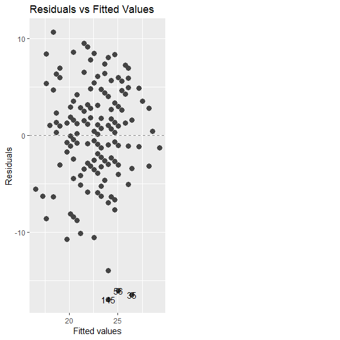
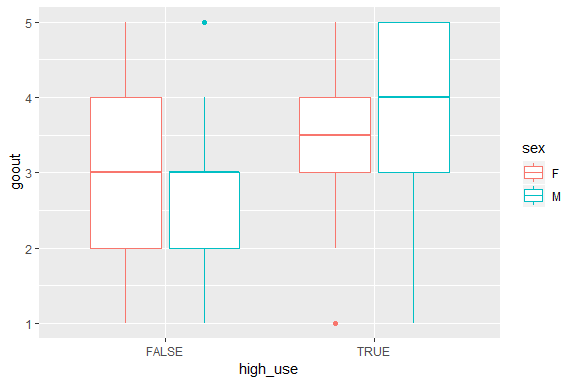

***
  


# About the project

*Write a short description about the course and add a link to your github repository here. This is an R markdown (.Rmd) file so you can use R markdown syntax. See the 'Useful links' page in the mooc area (chapter 1) for instructions.*

## Course:
I got interested in this course after looking at the course content. The course covers important topic from the field of data science such as regression, logistic regression, clustering, classification, analysis and most importantly it gives an opportunity to learn R. 
Instead of learning R separately and learning the above mentioned topics in some other course, this course provides the platform to learn and practice at the same time. 

## My Repository:
https://github.com/Zafarhussain87/IODS-project

  
***
  

# Regression and Model Validation

*In this chapter, we tried to learn how to clean up the data and how to make it ready for the anaysis phase.*

**Data Wrangling:**

I read the data from the given URL into csv format. 
I checked its structure and dimensions and matched them with the information given in the start of the exercise.
Then i added deep, strategic, and surface learning columns by combining different columns related to the mentioned categories. 
Then i created a new dataset with the 7 variables as instructed and saved in a csv and tabular form in my local directory.

```r
learning_data <- read.csv('C:/Users/Zafar/Documents/GitHub/IODS-project/data/learning2014.csv', sep=",")
head(learning_data)
```

```
##   gender Age attitude     deep  stra     surf Points
## 1      F  53      3.7 3.583333 3.375 2.583333     25
## 2      M  55      3.1 2.916667 2.750 3.166667     12
## 3      F  49      2.5 3.500000 3.625 2.250000     24
## 4      M  53      3.5 3.500000 3.125 2.250000     10
## 5      M  49      3.7 3.666667 3.625 2.833333     22
## 6      F  38      3.8 4.750000 3.625 2.416667     21
```

```r
str(learning_data)
```

```
## 'data.frame':	166 obs. of  7 variables:
##  $ gender  : Factor w/ 2 levels "F","M": 1 2 1 2 2 1 2 1 2 1 ...
##  $ Age     : int  53 55 49 53 49 38 50 37 37 42 ...
##  $ attitude: num  3.7 3.1 2.5 3.5 3.7 3.8 3.5 2.9 3.8 2.1 ...
##  $ deep    : num  3.58 2.92 3.5 3.5 3.67 ...
##  $ stra    : num  3.38 2.75 3.62 3.12 3.62 ...
##  $ surf    : num  2.58 3.17 2.25 2.25 2.83 ...
##  $ Points  : int  25 12 24 10 22 21 21 31 24 26 ...
```

```r
dim(learning_data)
```

```
## [1] 166   7
```

**Data Analysis:**

For this phase i read the newly created dataset from my local directory.
I created pairs plots to check and understand the correlations between variables. 
After that i plotted some simple results to check the relationships between attitude of students and their deep learning, age and their strategic learning , points and their attitude. 

```r
library(ggplot2)
pairs(learning_data)
```

<!-- -->


I had to understand the relationship of these variables and compare them with each other for better understanding. 
Then i tried to fit linear models on the same variables and extracted their summaries.

```r
plot1 <- ggplot(learning_data, aes(x = attitude, y = Points, col=gender))
plot1 <- plot1 + geom_point() +stat_smooth(method = lm)
plot1
```

<!-- -->

```r
plot2 <- ggplot(learning_data, aes(attitude, deep, col = gender))
plot2 <- plot2 + geom_point()  +stat_smooth(method = lm)
plot2
```

<!-- -->

```r
summary(learning_data$attitude)
```

```
##    Min. 1st Qu.  Median    Mean 3rd Qu.    Max. 
##   1.400   2.600   3.200   3.143   3.700   5.000
```

```r
summary(learning_data$deep)
```

```
##    Min. 1st Qu.  Median    Mean 3rd Qu.    Max. 
##   1.583   3.333   3.667   3.680   4.083   4.917
```

```r
plot3 <- ggplot(learning_data, aes(x = Age, y = stra, col = gender))
plot3 <- plot3 + geom_point() + stat_smooth(method=lm)
plot3
```

<!-- -->

In the last, as suggested, i made some plots to compare the Residulas and fitted models difference, normal Q-Q plots and Residuals and Leverage. 


```r
library(ggfortify)
mod1 <- lm(learning_data$Points ~ learning_data$attitude)
autoplot(mod1, which = 1, size = 3, smooth.linetype = "blank") + ggtitle("Residuals vs Fitted Values")
```

<!-- -->

```r
mod2 <- lm(learning_data$Points ~ learning_data$attitude)
autoplot(mod2, which = 2, size = 3, smooth.linetype = "blank") + ggtitle("Normal Q-Q Plot")
```

<!-- -->

```r
mod3 <- lm(learning_data$Points ~ learning_data$attitude)
autoplot(mod3, which = 5, size = 3, smooth.linetype = "blank") + ggtitle("Residuals vs Leverage")
```

<!-- -->

The results indicate that there are few variables which are highly correlated with some other variables. Like attitude is correlated with Points or we can say that Points are dependent on attitude. Similarly, Points and deep are correlated. 
Gender and age does not show any kind of strong correlation with other variabels. 

***
  

# Logistic Regression

The data attributes include student grades, demographic, social and school related features and it was collected by using school reports and questionnaires. Two datasets are provided regarding the performance in two distinct subjects: Mathematics (mat) and Portuguese language (por).
The variables are school names, student's gender, age their addresses, family size, cohabitation status of their parents either living together or apart, mother's and father's education and jobs, student's guardian, home to school travel time and their weekly study time. The data also contains information about number of past class failures 
extra educational support, family educational support, extra paid classes within the course subject (Math or Portuguese), extra-curricular activities, attended nursery school, Internet access at home, quality of family relationships,free time after school, going out with friends, workday alcohol consumption, weekend alcohol consumption and current health status.


```r
alc <- read.csv("D:/Study Material/Introduction to Open Data Science/IODS-project/data/student_alc_consumption.csv")

dim(alc)
```

```
## [1] 382  35
```

```r
colnames(alc)
```

```
##  [1] "school"     "sex"        "age"        "address"    "famsize"   
##  [6] "Pstatus"    "Medu"       "Fedu"       "Mjob"       "Fjob"      
## [11] "reason"     "nursery"    "internet"   "guardian"   "traveltime"
## [16] "studytime"  "failures"   "schoolsup"  "famsup"     "paid"      
## [21] "activities" "higher"     "romantic"   "famrel"     "freetime"  
## [26] "goout"      "Dalc"       "Walc"       "health"     "absences"  
## [31] "G1"         "G2"         "G3"         "alc_use"    "high_use"
```


The data attributes include student grades, demographic, social and school related features and it was collected by using school reports and questionnaires. Two datasets are provided regarding the performance in two distinct subjects: Mathematics (mat) and Portuguese language (por).
The variables are school names, student's gender, age their addresses, family size, cohabitation status of their parents either living together or apart, mother's and father's education and jobs, student's guardian, home to school travel time and their weekly study time. The data also contains information about number of past class failures 
extra educational support, family educational support, extra paid classes within the course subject (Math or Portuguese), extra-curricular activities, attended nursery school, Internet access at home, quality of family relationships,free time after school, going out with friends, workday alcohol consumption, weekend alcohol consumption and current health status.
Studying alocohal consumption and its relationship with other variables such as sex, grades, average past failures, average age of both genders, and absences.


```r
library(ggplot2)

plot1 <- ggplot(alc, aes(x = high_use, y = G3, col= sex))

plot1 + geom_boxplot() + ylab("grade") + ggtitle("Student grades by alcohol consumption and sex")
```

<!-- -->

```r
plot2 <- ggplot(alc, aes(x = high_use, y = absences, col= sex))

plot2 + geom_boxplot() + ggtitle("Student absences by alcohol consumption and sex")
```

<!-- -->

```r
plot3 <- ggplot(alc, aes(x = high_use, y = age, col= sex))

plot3 + geom_boxplot() + ggtitle("Student age by alcohol consumption and sex")
```

<!-- -->

```r
plot4 <- ggplot(alc, aes(x = high_use, y = goout, col= sex))
plot4 + geom_boxplot()
```

<!-- -->

The above numerical results and graphs show relationships between high usage of alcohol and different variables such as age, grades, absences and goout. 
If we look at the numerical results of grades and alcohol consumption, we can see that the Male students who have high usage of alcohol have less grades on average. 
The important and interesting aspect of the finding was the relationship of alcohol high use and failures. I calculated mean of failures and the results show that the Female students with high alcohol use have mean of 0.286 failures and Male students have mean of 0.375. These numbers are alot higher than the mean failures of those students who do not have high usage of alcohol. 
Similarly the graphs show that both Male and Female students with high usage of alcohol has low grades. 
Students with high usage of alcohol has high absent rate also. 
The age factor is surprising. Male students who are touching the age of 18 has higher alcohol usage as compared to Female students. Female students with high usage of alcohol have on average age of 17.
The last graph result shows that the Male students who have higher rate of Goout, also has higher rate of alcohol consumption. 

***
