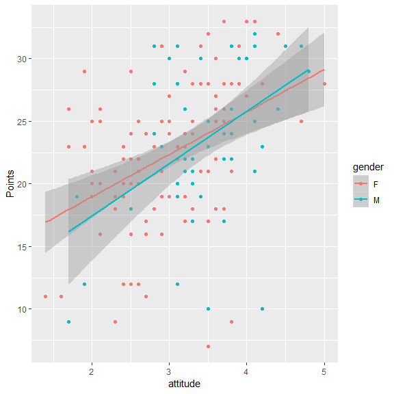
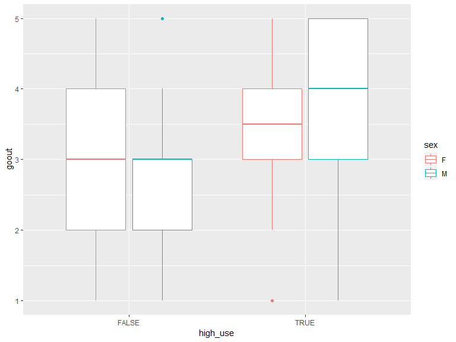
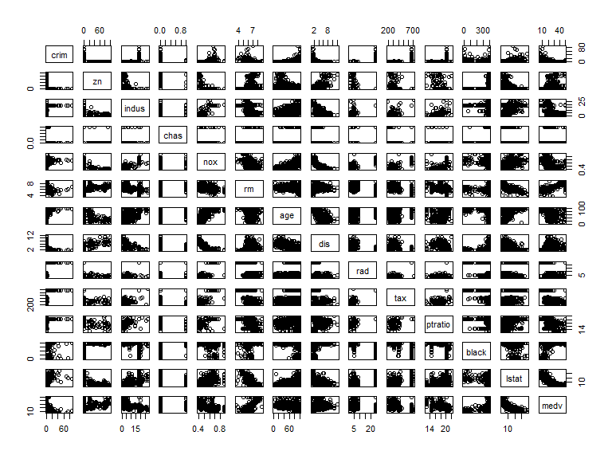
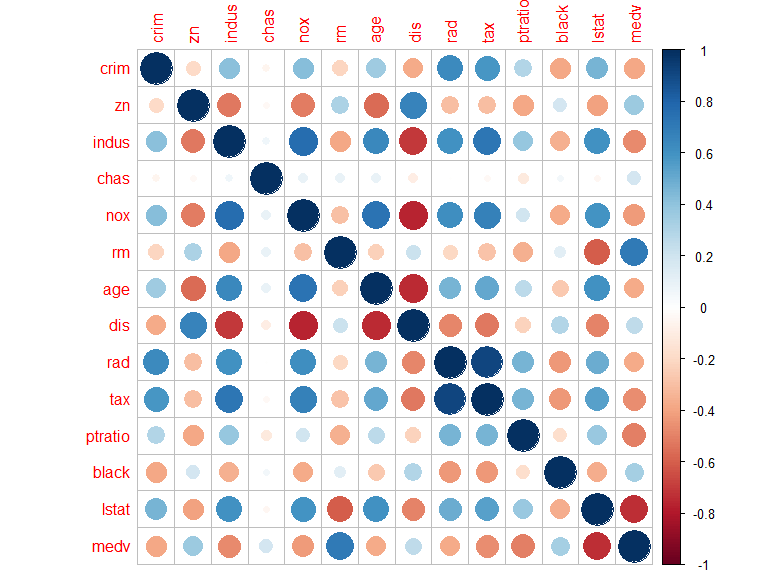
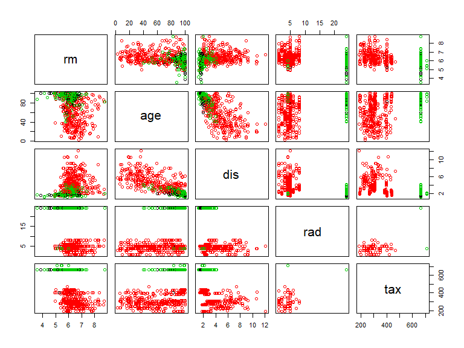
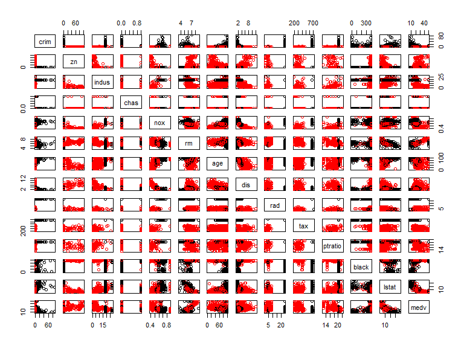
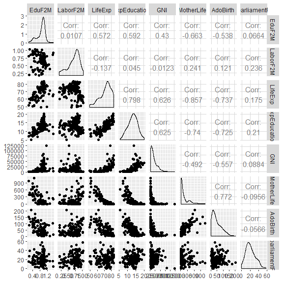
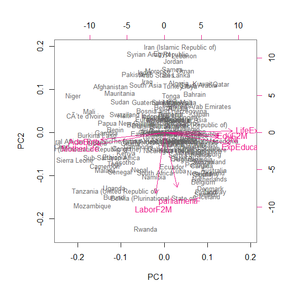
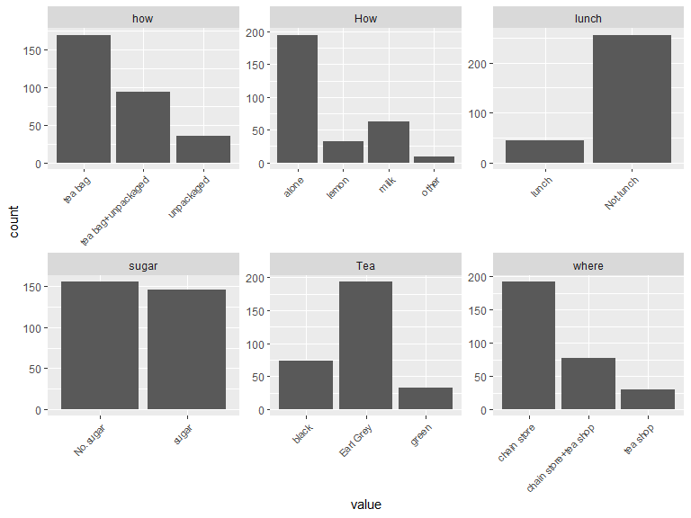

***
  


# About the project

*Write a short description about the course and add a link to your github repository here. This is an R markdown (.Rmd) file so you can use R markdown syntax. See the 'Useful links' page in the mooc area (chapter 1) for instructions.*

## Course:
I got interested in this course after looking at the course content. The course covers important topic from the field of data science such as regression, logistic regression, clustering, classification, analysis and most importantly it gives an opportunity to learn R. 
Instead of learning R separately and learning the above mentioned topics in some other course, this course provides the platform to learn and practice at the same time. 

## My Repository:
https://github.com/Zafarhussain87/IODS-project

  
***
  

# Regression and Model Validation

*In this chapter, we tried to learn how to clean up the data and how to make it ready for the anaysis phase.*

**Data Wrangling:**

I read the data from the given URL into csv format. 
I checked its structure and dimensions and matched them with the information given in the start of the exercise.
Then i added deep, strategic, and surface learning columns by combining different columns related to the mentioned categories. 
Then i created a new dataset with the 7 variables as instructed and saved in a csv and tabular form in my local directory.

```r
learning_data <- read.csv('C:/Users/Zafar/Documents/GitHub/IODS-project/data/learning2014.csv', sep=",")
head(learning_data)
```

```
##   gender Age attitude     deep  stra     surf Points
## 1      F  53      3.7 3.583333 3.375 2.583333     25
## 2      M  55      3.1 2.916667 2.750 3.166667     12
## 3      F  49      2.5 3.500000 3.625 2.250000     24
## 4      M  53      3.5 3.500000 3.125 2.250000     10
## 5      M  49      3.7 3.666667 3.625 2.833333     22
## 6      F  38      3.8 4.750000 3.625 2.416667     21
```

```r
str(learning_data)
```

```
## 'data.frame':	166 obs. of  7 variables:
##  $ gender  : Factor w/ 2 levels "F","M": 1 2 1 2 2 1 2 1 2 1 ...
##  $ Age     : int  53 55 49 53 49 38 50 37 37 42 ...
##  $ attitude: num  3.7 3.1 2.5 3.5 3.7 3.8 3.5 2.9 3.8 2.1 ...
##  $ deep    : num  3.58 2.92 3.5 3.5 3.67 ...
##  $ stra    : num  3.38 2.75 3.62 3.12 3.62 ...
##  $ surf    : num  2.58 3.17 2.25 2.25 2.83 ...
##  $ Points  : int  25 12 24 10 22 21 21 31 24 26 ...
```

```r
dim(learning_data)
```

```
## [1] 166   7
```

**Data Analysis:**

For this phase i read the newly created dataset from my local directory.
I created pairs plots to check and understand the correlations between variables. 
After that i plotted some simple results to check the relationships between attitude of students and their deep learning, age and their strategic learning , points and their attitude. 

```r
library(ggplot2)
pairs(learning_data)
```

<!-- -->


I had to understand the relationship of these variables and compare them with each other for better understanding. 
Then i tried to fit linear models on the same variables and extracted their summaries.

```r
plot1 <- ggplot(learning_data, aes(x = attitude, y = Points, col=gender))
plot1 <- plot1 + geom_point() +stat_smooth(method = lm)
plot1
```

<!-- -->

```r
plot2 <- ggplot(learning_data, aes(attitude, deep, col = gender))
plot2 <- plot2 + geom_point()  +stat_smooth(method = lm)
plot2
```

<!-- -->

```r
summary(learning_data$attitude)
```

```
##    Min. 1st Qu.  Median    Mean 3rd Qu.    Max. 
##   1.400   2.600   3.200   3.143   3.700   5.000
```

```r
summary(learning_data$deep)
```

```
##    Min. 1st Qu.  Median    Mean 3rd Qu.    Max. 
##   1.583   3.333   3.667   3.680   4.083   4.917
```

```r
plot3 <- ggplot(learning_data, aes(x = Age, y = stra, col = gender))
plot3 <- plot3 + geom_point() + stat_smooth(method=lm)
plot3
```

<!-- -->

In the last, as suggested, i made some plots to compare the Residulas and fitted models difference, normal Q-Q plots and Residuals and Leverage. 


```r
library(ggfortify)
mod1 <- lm(learning_data$Points ~ learning_data$attitude)
autoplot(mod1, which = 1, size = 3, smooth.linetype = "blank") + ggtitle("Residuals vs Fitted Values")
```

<!-- -->

```r
mod2 <- lm(learning_data$Points ~ learning_data$attitude)
autoplot(mod2, which = 2, size = 3, smooth.linetype = "blank") + ggtitle("Normal Q-Q Plot")
```

<!-- -->

```r
mod3 <- lm(learning_data$Points ~ learning_data$attitude)
autoplot(mod3, which = 5, size = 3, smooth.linetype = "blank") + ggtitle("Residuals vs Leverage")
```

<!-- -->

The results indicate that there are few variables which are highly correlated with some other variables. Like attitude is correlated with Points or we can say that Points are dependent on attitude. Similarly, Points and deep are correlated. 
Gender and age does not show any kind of strong correlation with other variabels. 

***

# Logistic Regression

The data attributes include student grades, demographic, social and school related features and it was collected by using school reports and questionnaires. Two datasets are provided regarding the performance in two distinct subjects: Mathematics (mat) and Portuguese language (por).
The variables are school names, student's gender, age their addresses, family size, cohabitation status of their parents either living together or apart, mother's and father's education and jobs, student's guardian, home to school travel time and their weekly study time. The data also contains information about number of past class failures 
extra educational support, family educational support, extra paid classes within the course subject (Math or Portuguese), extra-curricular activities, attended nursery school, Internet access at home, quality of family relationships,free time after school, going out with friends, workday alcohol consumption, weekend alcohol consumption and current health status.


```r
alc <- read.csv("D:/Study Material/Introduction to Open Data Science/IODS-project/data/student_alc_consumption.csv")

dim(alc)
```

```
## [1] 382  35
```

```r
colnames(alc)
```

```
##  [1] "school"     "sex"        "age"        "address"    "famsize"   
##  [6] "Pstatus"    "Medu"       "Fedu"       "Mjob"       "Fjob"      
## [11] "reason"     "nursery"    "internet"   "guardian"   "traveltime"
## [16] "studytime"  "failures"   "schoolsup"  "famsup"     "paid"      
## [21] "activities" "higher"     "romantic"   "famrel"     "freetime"  
## [26] "goout"      "Dalc"       "Walc"       "health"     "absences"  
## [31] "G1"         "G2"         "G3"         "alc_use"    "high_use"
```


The data attributes include student grades, demographic, social and school related features and it was collected by using school reports and questionnaires. Two datasets are provided regarding the performance in two distinct subjects: Mathematics (mat) and Portuguese language (por).
The variables are school names, student's gender, age their addresses, family size, cohabitation status of their parents either living together or apart, mother's and father's education and jobs, student's guardian, home to school travel time and their weekly study time. The data also contains information about number of past class failures 
extra educational support, family educational support, extra paid classes within the course subject (Math or Portuguese), extra-curricular activities, attended nursery school, Internet access at home, quality of family relationships,free time after school, going out with friends, workday alcohol consumption, weekend alcohol consumption and current health status.
Studying alocohal consumption and its relationship with other variables such as sex, grades, average past failures, average age of both genders, and absences.


```r
library(ggplot2)

plot1 <- ggplot(alc, aes(x = high_use, y = G3, col= sex))

plot1 + geom_boxplot() + ylab("grade") + ggtitle("Student grades by alcohol consumption and sex")
```

<!-- -->

```r
plot2 <- ggplot(alc, aes(x = high_use, y = absences, col= sex))

plot2 + geom_boxplot() + ggtitle("Student absences by alcohol consumption and sex")
```

<!-- -->

```r
plot3 <- ggplot(alc, aes(x = high_use, y = age, col= sex))

plot3 + geom_boxplot() + ggtitle("Student age by alcohol consumption and sex")
```

<!-- -->

```r
plot4 <- ggplot(alc, aes(x = high_use, y = goout, col= sex))
plot4 + geom_boxplot()
```

<!-- -->

The above numerical results and graphs show relationships between high usage of alcohol and different variables such as age, grades, absences and goout. 
If we look at the numerical results of grades and alcohol consumption, we can see that the Male students who have high usage of alcohol have less grades on average. 
The important and interesting aspect of the finding was the relationship of alcohol high use and failures. I calculated mean of failures and the results show that the Female students with high alcohol use have mean of 0.286 failures and Male students have mean of 0.375. These numbers are alot higher than the mean failures of those students who do not have high usage of alcohol. 
Similarly the graphs show that both Male and Female students with high usage of alcohol has low grades. 
Students with high usage of alcohol has high absent rate also. 
The age factor is surprising. Male students who are touching the age of 18 has higher alcohol usage as compared to Female students. Female students with high usage of alcohol have on average age of 17.
The last graph result shows that the Male students who have higher rate of Goout, also has higher rate of alcohol consumption. 

Now fitting the Regression Model on the above mentioned variables.


```r
rm <- glm(high_use ~ failures + absences + sex, data = alc, family = "binomial")

summary(rm)
```

```
## 
## Call:
## glm(formula = high_use ~ failures + absences + sex, family = "binomial", 
##     data = alc)
## 
## Deviance Residuals: 
##     Min       1Q   Median       3Q      Max  
## -2.1855  -0.8371  -0.6000   1.1020   2.0209  
## 
## Coefficients:
##             Estimate Std. Error z value Pr(>|z|)    
## (Intercept) -1.90297    0.22626  -8.411  < 2e-16 ***
## failures     0.45082    0.18992   2.374 0.017611 *  
## absences     0.09322    0.02295   4.063 4.85e-05 ***
## sexM         0.94117    0.24200   3.889 0.000101 ***
## ---
## Signif. codes:  0 '***' 0.001 '**' 0.01 '*' 0.05 '.' 0.1 ' ' 1
## 
## (Dispersion parameter for binomial family taken to be 1)
## 
##     Null deviance: 465.68  on 381  degrees of freedom
## Residual deviance: 424.40  on 378  degrees of freedom
## AIC: 432.4
## 
## Number of Fisher Scoring iterations: 4
```

```r
coef(rm)
```

```
## (Intercept)    failures    absences        sexM 
## -1.90296550  0.45081981  0.09321999  0.94116602
```
Summary and Coefficients are dervied above. Now computing Odd Ratios and Confidence Intervals.

```r
OR <- coef(rm) %>% exp()

CI <- confint(rm) %>% exp()
```

```
## Waiting for profiling to be done...
```

```r
cbind(OR, CI)
```

```
##                    OR      2.5 %   97.5 %
## (Intercept) 0.1491257 0.09395441 0.228611
## failures    1.5695984 1.08339644 2.294737
## absences    1.0977032 1.05169654 1.150848
## sexM        2.5629682 1.60381392 4.149405
```
Now fitting the model again and predicting the high use of alcohol for the mentioned variables.


```r
rm3 <- glm(high_use ~ failures + absences + sex, data = alc, family = "binomial")


probabilities <- predict(rm3, type = "response")

alc <- mutate(alc, probability = probabilities)

alc <- mutate(alc, prediction = ifelse (probability > 0.5, TRUE, FALSE))

select(alc, failures, absences, sex, high_use, probability, prediction) %>% head(10)
```

```
##    failures absences sex high_use probability prediction
## 1         0        5   F    FALSE   0.1920312      FALSE
## 2         0        3   F    FALSE   0.1647495      FALSE
## 3         2        8   F     TRUE   0.4364540      FALSE
## 4         0        1   F    FALSE   0.1406689      FALSE
## 5         0        2   F    FALSE   0.1523192      FALSE
## 6         0        8   M    FALSE   0.4461992      FALSE
## 7         0        0   M    FALSE   0.2765181      FALSE
## 8         0        4   F    FALSE   0.1779812      FALSE
## 9         0        0   M    FALSE   0.2765181      FALSE
## 10        0        0   M    FALSE   0.2765181      FALSE
```

```r
table(high_use = alc$high_use, prediction = alc$prediction)
```

```
##         prediction
## high_use FALSE TRUE
##    FALSE   259    9
##    TRUE     84   30
```
Plotting the high use and above calculated probability against the predicted values of the model. 

```r
g <- ggplot(alc, aes(x = probability, y = high_use, col= prediction))

g + geom_point()
```

<!-- -->

***


# Clustering and Classification

Loading Boston data and reading its summary, structure and creating a pair plot for the understanding of the data.


```r
#Structure of the dataset
str(Boston)
```

```
## 'data.frame':	506 obs. of  14 variables:
##  $ crim   : num  0.00632 0.02731 0.02729 0.03237 0.06905 ...
##  $ zn     : num  18 0 0 0 0 0 12.5 12.5 12.5 12.5 ...
##  $ indus  : num  2.31 7.07 7.07 2.18 2.18 2.18 7.87 7.87 7.87 7.87 ...
##  $ chas   : int  0 0 0 0 0 0 0 0 0 0 ...
##  $ nox    : num  0.538 0.469 0.469 0.458 0.458 0.458 0.524 0.524 0.524 0.524 ...
##  $ rm     : num  6.58 6.42 7.18 7 7.15 ...
##  $ age    : num  65.2 78.9 61.1 45.8 54.2 58.7 66.6 96.1 100 85.9 ...
##  $ dis    : num  4.09 4.97 4.97 6.06 6.06 ...
##  $ rad    : int  1 2 2 3 3 3 5 5 5 5 ...
##  $ tax    : num  296 242 242 222 222 222 311 311 311 311 ...
##  $ ptratio: num  15.3 17.8 17.8 18.7 18.7 18.7 15.2 15.2 15.2 15.2 ...
##  $ black  : num  397 397 393 395 397 ...
##  $ lstat  : num  4.98 9.14 4.03 2.94 5.33 ...
##  $ medv   : num  24 21.6 34.7 33.4 36.2 28.7 22.9 27.1 16.5 18.9 ...
```

```r
#Summary of the dataset
summary(Boston)
```

```
##       crim                zn             indus            chas        
##  Min.   : 0.00632   Min.   :  0.00   Min.   : 0.46   Min.   :0.00000  
##  1st Qu.: 0.08204   1st Qu.:  0.00   1st Qu.: 5.19   1st Qu.:0.00000  
##  Median : 0.25651   Median :  0.00   Median : 9.69   Median :0.00000  
##  Mean   : 3.61352   Mean   : 11.36   Mean   :11.14   Mean   :0.06917  
##  3rd Qu.: 3.67708   3rd Qu.: 12.50   3rd Qu.:18.10   3rd Qu.:0.00000  
##  Max.   :88.97620   Max.   :100.00   Max.   :27.74   Max.   :1.00000  
##       nox               rm             age              dis        
##  Min.   :0.3850   Min.   :3.561   Min.   :  2.90   Min.   : 1.130  
##  1st Qu.:0.4490   1st Qu.:5.886   1st Qu.: 45.02   1st Qu.: 2.100  
##  Median :0.5380   Median :6.208   Median : 77.50   Median : 3.207  
##  Mean   :0.5547   Mean   :6.285   Mean   : 68.57   Mean   : 3.795  
##  3rd Qu.:0.6240   3rd Qu.:6.623   3rd Qu.: 94.08   3rd Qu.: 5.188  
##  Max.   :0.8710   Max.   :8.780   Max.   :100.00   Max.   :12.127  
##       rad              tax           ptratio          black       
##  Min.   : 1.000   Min.   :187.0   Min.   :12.60   Min.   :  0.32  
##  1st Qu.: 4.000   1st Qu.:279.0   1st Qu.:17.40   1st Qu.:375.38  
##  Median : 5.000   Median :330.0   Median :19.05   Median :391.44  
##  Mean   : 9.549   Mean   :408.2   Mean   :18.46   Mean   :356.67  
##  3rd Qu.:24.000   3rd Qu.:666.0   3rd Qu.:20.20   3rd Qu.:396.23  
##  Max.   :24.000   Max.   :711.0   Max.   :22.00   Max.   :396.90  
##      lstat            medv      
##  Min.   : 1.73   Min.   : 5.00  
##  1st Qu.: 6.95   1st Qu.:17.02  
##  Median :11.36   Median :21.20  
##  Mean   :12.65   Mean   :22.53  
##  3rd Qu.:16.95   3rd Qu.:25.00  
##  Max.   :37.97   Max.   :50.00
```

```r
# plotting matrix of the variables
pairs(Boston)
```

<!-- -->

Now finding the correlation between different variables of the loaded data. 


```r
# print the correlation matrix
cor_matrix
```

```
##          crim    zn indus  chas   nox    rm   age   dis   rad   tax
## crim     1.00 -0.20  0.41 -0.06  0.42 -0.22  0.35 -0.38  0.63  0.58
## zn      -0.20  1.00 -0.53 -0.04 -0.52  0.31 -0.57  0.66 -0.31 -0.31
## indus    0.41 -0.53  1.00  0.06  0.76 -0.39  0.64 -0.71  0.60  0.72
## chas    -0.06 -0.04  0.06  1.00  0.09  0.09  0.09 -0.10 -0.01 -0.04
## nox      0.42 -0.52  0.76  0.09  1.00 -0.30  0.73 -0.77  0.61  0.67
## rm      -0.22  0.31 -0.39  0.09 -0.30  1.00 -0.24  0.21 -0.21 -0.29
## age      0.35 -0.57  0.64  0.09  0.73 -0.24  1.00 -0.75  0.46  0.51
## dis     -0.38  0.66 -0.71 -0.10 -0.77  0.21 -0.75  1.00 -0.49 -0.53
## rad      0.63 -0.31  0.60 -0.01  0.61 -0.21  0.46 -0.49  1.00  0.91
## tax      0.58 -0.31  0.72 -0.04  0.67 -0.29  0.51 -0.53  0.91  1.00
## ptratio  0.29 -0.39  0.38 -0.12  0.19 -0.36  0.26 -0.23  0.46  0.46
## black   -0.39  0.18 -0.36  0.05 -0.38  0.13 -0.27  0.29 -0.44 -0.44
## lstat    0.46 -0.41  0.60 -0.05  0.59 -0.61  0.60 -0.50  0.49  0.54
## medv    -0.39  0.36 -0.48  0.18 -0.43  0.70 -0.38  0.25 -0.38 -0.47
##         ptratio black lstat  medv
## crim       0.29 -0.39  0.46 -0.39
## zn        -0.39  0.18 -0.41  0.36
## indus      0.38 -0.36  0.60 -0.48
## chas      -0.12  0.05 -0.05  0.18
## nox        0.19 -0.38  0.59 -0.43
## rm        -0.36  0.13 -0.61  0.70
## age        0.26 -0.27  0.60 -0.38
## dis       -0.23  0.29 -0.50  0.25
## rad        0.46 -0.44  0.49 -0.38
## tax        0.46 -0.44  0.54 -0.47
## ptratio    1.00 -0.18  0.37 -0.51
## black     -0.18  1.00 -0.37  0.33
## lstat      0.37 -0.37  1.00 -0.74
## medv      -0.51  0.33 -0.74  1.00
```

```r
# visualizing the correlation matrix
corrplot(cor_matrix, method="circle")
```

<!-- -->

Now scaling the dataset and converting it into data frame to perform comparisons and predictions on the dataset.


```r
# summaries of the scaled variables
summary(boston_scaled)
```

```
##       crim                 zn               indus        
##  Min.   :-0.419367   Min.   :-0.48724   Min.   :-1.5563  
##  1st Qu.:-0.410563   1st Qu.:-0.48724   1st Qu.:-0.8668  
##  Median :-0.390280   Median :-0.48724   Median :-0.2109  
##  Mean   : 0.000000   Mean   : 0.00000   Mean   : 0.0000  
##  3rd Qu.: 0.007389   3rd Qu.: 0.04872   3rd Qu.: 1.0150  
##  Max.   : 9.924110   Max.   : 3.80047   Max.   : 2.4202  
##       chas              nox                rm               age         
##  Min.   :-0.2723   Min.   :-1.4644   Min.   :-3.8764   Min.   :-2.3331  
##  1st Qu.:-0.2723   1st Qu.:-0.9121   1st Qu.:-0.5681   1st Qu.:-0.8366  
##  Median :-0.2723   Median :-0.1441   Median :-0.1084   Median : 0.3171  
##  Mean   : 0.0000   Mean   : 0.0000   Mean   : 0.0000   Mean   : 0.0000  
##  3rd Qu.:-0.2723   3rd Qu.: 0.5981   3rd Qu.: 0.4823   3rd Qu.: 0.9059  
##  Max.   : 3.6648   Max.   : 2.7296   Max.   : 3.5515   Max.   : 1.1164  
##       dis               rad               tax             ptratio       
##  Min.   :-1.2658   Min.   :-0.9819   Min.   :-1.3127   Min.   :-2.7047  
##  1st Qu.:-0.8049   1st Qu.:-0.6373   1st Qu.:-0.7668   1st Qu.:-0.4876  
##  Median :-0.2790   Median :-0.5225   Median :-0.4642   Median : 0.2746  
##  Mean   : 0.0000   Mean   : 0.0000   Mean   : 0.0000   Mean   : 0.0000  
##  3rd Qu.: 0.6617   3rd Qu.: 1.6596   3rd Qu.: 1.5294   3rd Qu.: 0.8058  
##  Max.   : 3.9566   Max.   : 1.6596   Max.   : 1.7964   Max.   : 1.6372  
##      black             lstat              medv        
##  Min.   :-3.9033   Min.   :-1.5296   Min.   :-1.9063  
##  1st Qu.: 0.2049   1st Qu.:-0.7986   1st Qu.:-0.5989  
##  Median : 0.3808   Median :-0.1811   Median :-0.1449  
##  Mean   : 0.0000   Mean   : 0.0000   Mean   : 0.0000  
##  3rd Qu.: 0.4332   3rd Qu.: 0.6024   3rd Qu.: 0.2683  
##  Max.   : 0.4406   Max.   : 3.5453   Max.   : 2.9865
```


AFter scaling the dataset, next task was to see the summary of the crime variable and then convert the crime variable into quantiles. 


```r
summary(boston_scaled$crim)
```

```
##      Min.   1st Qu.    Median      Mean   3rd Qu.      Max. 
## -0.419367 -0.410563 -0.390280  0.000000  0.007389  9.924110
```

```r
bins <- quantile(boston_scaled$crim)
bins
```

```
##           0%          25%          50%          75%         100% 
## -0.419366929 -0.410563278 -0.390280295  0.007389247  9.924109610
```

Then created a categorical variable and named it 'crime'. 


```r
# look at the table of the new factor crime
table(crime)
```

```
## crime
##      low  med_low med_high     high 
##      127      126      126      127
```


Now as we have created a categorical variable crime and scaled our dataset, we can train our data and then run Linear Data Analysis for the prediction of crime. We have used 80, 20 percent of the data for training and testing respectively. 


```r
# print the result of LDA model
lda.fit
```

```
## Call:
## lda(crime ~ ., data = train)
## 
## Prior probabilities of groups:
##       low   med_low  med_high      high 
## 0.2599010 0.2475248 0.2599010 0.2326733 
## 
## Group means:
##                  zn      indus        chas        nox         rm
## low       1.0120304 -0.9106317 -0.08484810 -0.8718702  0.4649337
## med_low  -0.1234277 -0.2907545 -0.07547406 -0.5540848 -0.1577593
## med_high -0.3712677  0.1425281  0.29011382  0.3379606  0.1128351
## high     -0.4872402  1.0172896 -0.10479289  1.0830996 -0.4522852
##                 age        dis        rad        tax     ptratio
## low      -0.8755034  0.9063465 -0.6898324 -0.7482823 -0.45632305
## med_low  -0.3556059  0.3244707 -0.5511961 -0.5052724 -0.06445132
## med_high  0.3594615 -0.3588894 -0.3901372 -0.3132785 -0.28739765
## high      0.8378931 -0.8566338  1.6363892  1.5128120  0.77875205
##               black       lstat         medv
## low       0.3725184 -0.77713088  0.546606152
## med_low   0.3100193 -0.16225364 -0.002479729
## med_high  0.1226060  0.01876253  0.194217797
## high     -0.7959583  0.90132326 -0.722572260
## 
## Coefficients of linear discriminants:
##                  LD1         LD2         LD3
## zn       0.093303163  0.78623799 -0.85826519
## indus   -0.024805267 -0.17476745  0.28863064
## chas    -0.094516890 -0.09918231 -0.07865590
## nox      0.456665446 -0.65849636 -1.38610812
## rm      -0.094001563 -0.04756070 -0.22435091
## age      0.320661104 -0.21549461 -0.21395135
## dis     -0.018288562 -0.22647607  0.01414379
## rad      2.960826469  1.00771894  0.09999089
## tax      0.006908543 -0.17149460  0.41801575
## ptratio  0.135890354  0.02590884 -0.32585434
## black   -0.143561964 -0.02171801  0.10011367
## lstat    0.258012228 -0.29643269  0.20216955
## medv     0.223212834 -0.45754488 -0.31345325
## 
## Proportion of trace:
##    LD1    LD2    LD3 
## 0.9455 0.0403 0.0142
```


```r
# plot the lda results
plot(lda.fit, dimen = 2, col= classes, pch=classes)
lda.arrows(lda.fit, myscale = 2)
```

<!-- -->


```r
# Comparing the results of correct classes and predicted classes, in tabular form.  
table(correct =correct_classes , predicted = lda.pred$class)
```

```
##           predicted
## correct    low med_low med_high high
##   low       12       7        3    0
##   med_low    6      12        8    0
##   med_high   0       3       18    0
##   high       0       0        0   33
```

Our model shows pretty good results for the given data. The graph and the table are closely predicting the correct result.

Now as we have trained our model, we will use K-means clustering method and explore the variables and will find their relevant clusters.


We used two methods in distance measuing, Euclidean and Manhattan. 
Following are the results of both methods.

```r
# summary of the Euclidean distances
summary(dist_eu)
```

```
##    Min. 1st Qu.  Median    Mean 3rd Qu.    Max. 
##   1.119  85.624 170.539 226.315 371.950 626.047
```

```r
# summary of the Manhattan distances
summary(dist_man)
```

```
##     Min.  1st Qu.   Median     Mean  3rd Qu.     Max. 
##    2.016  149.145  279.505  342.899  509.707 1198.265
```


```r
# plot the Boston dataset with clusters
pairs(Boston[6:10], col = km$cluster)
```

<!-- -->


```r
# visualize the results
qplot(x = 1:k_max, y = twcss, geom = 'line')
```

<!-- -->


The thoery states that "When you plot the number of clusters and the total within cluster sum of squares (WCSS), the optimal number of clusters is when the total WCSS drops radically". Our result shows that when the number of clusters were two, WCSS drops exponentially. It means that in our case the optimal number of clusters are two. 


```r
# plot the Boston dataset with clusters
pairs(Boston, col = km$cluster)
```

<!-- -->


***


# Dimensionality Reduction: PCA & MCA
Created human file/data from the given source and wrangled it enough for further usage. Reading the wrangled data and confirming the dimensionalities match with the given one.


```r
dim(human_data)
```

```
## [1] 155   8
```

```r
head(human_data)
```

```
##                EduF2M  LaborF2M LifeExp ExpEducation   GNI MotherLife
## Afghanistan 0.1979866 0.1987421    60.4          9.3  1885        400
## Albania     0.9306030 0.6854962    77.8         11.8  9943         21
## Algeria     0.8612903 0.2105263    74.8         14.0 13054         89
## Arab States 0.7289916 0.3081009    70.6         12.0 15722        155
## Argentina   0.9774306 0.6333333    76.3         17.9 22050         69
## Armenia     0.9894737 0.7465565    74.7         12.3  8124         29
##             AdoBirth parliamentF
## Afghanistan     86.8        27.6
## Albania         15.3        20.7
## Algeria         10.0        25.7
## Arab States     45.4        14.0
## Argentina       54.4        36.8
## Armenia         27.1        10.7
```

```r
summary(human_data)
```

```
##      EduF2M          LaborF2M         LifeExp       ExpEducation  
##  Min.   :0.1717   Min.   :0.1857   Min.   :49.00   Min.   : 5.40  
##  1st Qu.:0.7264   1st Qu.:0.5965   1st Qu.:67.25   1st Qu.:11.25  
##  Median :0.9359   Median :0.7523   Median :74.00   Median :13.50  
##  Mean   :0.8524   Mean   :0.7026   Mean   :71.72   Mean   :13.16  
##  3rd Qu.:0.9957   3rd Qu.:0.8454   3rd Qu.:77.15   3rd Qu.:15.20  
##  Max.   :1.4967   Max.   :1.0380   Max.   :83.50   Max.   :20.20  
##       GNI           MotherLife        AdoBirth       parliamentF   
##  Min.   :   581   Min.   :   1.0   Min.   :  0.60   Min.   : 0.00  
##  1st Qu.:  4737   1st Qu.:  11.5   1st Qu.: 12.65   1st Qu.:12.50  
##  Median : 12122   Median :  50.0   Median : 32.80   Median :19.30  
##  Mean   : 17717   Mean   : 148.0   Mean   : 46.58   Mean   :21.02  
##  3rd Qu.: 24512   3rd Qu.: 186.5   3rd Qu.: 71.65   3rd Qu.:27.65  
##  Max.   :123124   Max.   :1100.0   Max.   :204.80   Max.   :57.50
```

The results show that we have 155 rows and 8 columns now. We have mapped the data with countries as rows for better understanding. 

The data consists of 8 features which are representing Women empowerment in different countries regarding education, work, Expected life and average life with representation in the parliament.

Then performed Prinicple Component Analysis (PCA) without normalizing the data. It is difficult to understand the resutls in graphical format as the features are making no sense.

<!-- -->

For a better understanding, we have to standardize the data. 

```r
human_std <- scale(human_data)

human_pca <- prcomp(human_std)

biplot(human_pca, choices = 1:2, cex=c(0.8,1), col=c("grey40", "deeppink2"))
```

<!-- -->

```r
s <- summary(human_pca)
s
```

```
## Importance of components:
##                           PC1    PC2     PC3     PC4     PC5     PC6
## Standard deviation     2.0755 1.1342 0.88683 0.77944 0.66236 0.51776
## Proportion of Variance 0.5385 0.1608 0.09831 0.07594 0.05484 0.03351
## Cumulative Proportion  0.5385 0.6993 0.79758 0.87352 0.92836 0.96187
##                            PC7     PC8
## Standard deviation     0.45219 0.31709
## Proportion of Variance 0.02556 0.01257
## Cumulative Proportion  0.98743 1.00000
```

Now the results are creating some understanding as we cans ee that Female to male education ratio, Average life expectancy, Gross National Income and Expected Education is strongly correlated towards to Pricniple Component 1. 
The results depict that Adolesent birth and Mother's life are correlated to Principle Component 2. 
two interesting features Female representation in Parliament and Labor ration with male is uncorrelated to Principle Component 2 and note correlated with Principle Component 1 either.

We can see from the plot given below the percentage of first 2 principle components and the correlation of different features with them.

<!-- -->

 If we look at the sumamries given above and the graph showing below, we can see that the optimal number of Principle Components which are more significant to data are two.
 Screeplot is showing the exponential change in the variance when the Principle Components went from 1 to 2. 
 

```r
screeplot(human_pca, npcs = 8, type = "lines", main = "Optimal number of PCs")
```

<!-- -->

Since we are studying component analysis in this week and PCA works for quantitative date or numerical values but if our data is qualitative or categorical, we will use Multiple Correspondence Analysis (MCA). 
MCA takes multiple categorical variables and seeks to identify associations between levels of those variables.
We are using "tea" dataset here which has 300 X 36 dimensions. 
Just for the understanding of the concepts, we are using only 6 features here. 


```r
# look at the summaries and structure of the data
dim(tea_time)
```

```
## [1] 300   6
```

```r
names(tea_time)
```

```
## [1] "Tea"   "How"   "how"   "sugar" "where" "lunch"
```

```r
summary(tea_time)
```

```
##         Tea         How                      how           sugar    
##  black    : 74   alone:195   tea bag           :170   No.sugar:155  
##  Earl Grey:193   lemon: 33   tea bag+unpackaged: 94   sugar   :145  
##  green    : 33   milk : 63   unpackaged        : 36                 
##                  other:  9                                          
##                   where           lunch    
##  chain store         :192   lunch    : 44  
##  chain store+tea shop: 78   Not.lunch:256  
##  tea shop            : 30                  
## 
```

```r
str(tea_time)
```

```
## 'data.frame':	300 obs. of  6 variables:
##  $ Tea  : Factor w/ 3 levels "black","Earl Grey",..: 1 1 2 2 2 2 2 1 2 1 ...
##  $ How  : Factor w/ 4 levels "alone","lemon",..: 1 3 1 1 1 1 1 3 3 1 ...
##  $ how  : Factor w/ 3 levels "tea bag","tea bag+unpackaged",..: 1 1 1 1 1 1 1 1 2 2 ...
##  $ sugar: Factor w/ 2 levels "No.sugar","sugar": 2 1 1 2 1 1 1 1 1 1 ...
##  $ where: Factor w/ 3 levels "chain store",..: 1 1 1 1 1 1 1 1 2 2 ...
##  $ lunch: Factor w/ 2 levels "lunch","Not.lunch": 2 2 2 2 2 2 2 2 2 2 ...
```

<!-- -->


```r
# summary of the model
summary(mca)
```

```
## 
## Call:
## MCA(X = tea_time, graph = FALSE) 
## 
## 
## Eigenvalues
##                        Dim.1   Dim.2   Dim.3   Dim.4   Dim.5   Dim.6
## Variance               0.279   0.261   0.219   0.189   0.177   0.156
## % of var.             15.238  14.232  11.964  10.333   9.667   8.519
## Cumulative % of var.  15.238  29.471  41.435  51.768  61.434  69.953
##                        Dim.7   Dim.8   Dim.9  Dim.10  Dim.11
## Variance               0.144   0.141   0.117   0.087   0.062
## % of var.              7.841   7.705   6.392   4.724   3.385
## Cumulative % of var.  77.794  85.500  91.891  96.615 100.000
## 
## Individuals (the 10 first)
##                       Dim.1    ctr   cos2    Dim.2    ctr   cos2    Dim.3
## 1                  | -0.298  0.106  0.086 | -0.328  0.137  0.105 | -0.327
## 2                  | -0.237  0.067  0.036 | -0.136  0.024  0.012 | -0.695
## 3                  | -0.369  0.162  0.231 | -0.300  0.115  0.153 | -0.202
## 4                  | -0.530  0.335  0.460 | -0.318  0.129  0.166 |  0.211
## 5                  | -0.369  0.162  0.231 | -0.300  0.115  0.153 | -0.202
## 6                  | -0.369  0.162  0.231 | -0.300  0.115  0.153 | -0.202
## 7                  | -0.369  0.162  0.231 | -0.300  0.115  0.153 | -0.202
## 8                  | -0.237  0.067  0.036 | -0.136  0.024  0.012 | -0.695
## 9                  |  0.143  0.024  0.012 |  0.871  0.969  0.435 | -0.067
## 10                 |  0.476  0.271  0.140 |  0.687  0.604  0.291 | -0.650
##                       ctr   cos2  
## 1                   0.163  0.104 |
## 2                   0.735  0.314 |
## 3                   0.062  0.069 |
## 4                   0.068  0.073 |
## 5                   0.062  0.069 |
## 6                   0.062  0.069 |
## 7                   0.062  0.069 |
## 8                   0.735  0.314 |
## 9                   0.007  0.003 |
## 10                  0.643  0.261 |
## 
## Categories (the 10 first)
##                        Dim.1     ctr    cos2  v.test     Dim.2     ctr
## black              |   0.473   3.288   0.073   4.677 |   0.094   0.139
## Earl Grey          |  -0.264   2.680   0.126  -6.137 |   0.123   0.626
## green              |   0.486   1.547   0.029   2.952 |  -0.933   6.111
## alone              |  -0.018   0.012   0.001  -0.418 |  -0.262   2.841
## lemon              |   0.669   2.938   0.055   4.068 |   0.531   1.979
## milk               |  -0.337   1.420   0.030  -3.002 |   0.272   0.990
## other              |   0.288   0.148   0.003   0.876 |   1.820   6.347
## tea bag            |  -0.608  12.499   0.483 -12.023 |  -0.351   4.459
## tea bag+unpackaged |   0.350   2.289   0.056   4.088 |   1.024  20.968
## unpackaged         |   1.958  27.432   0.523  12.499 |  -1.015   7.898
##                       cos2  v.test     Dim.3     ctr    cos2  v.test  
## black                0.003   0.929 |  -1.081  21.888   0.382 -10.692 |
## Earl Grey            0.027   2.867 |   0.433   9.160   0.338  10.053 |
## green                0.107  -5.669 |  -0.108   0.098   0.001  -0.659 |
## alone                0.127  -6.164 |  -0.113   0.627   0.024  -2.655 |
## lemon                0.035   3.226 |   1.329  14.771   0.218   8.081 |
## milk                 0.020   2.422 |   0.013   0.003   0.000   0.116 |
## other                0.102   5.534 |  -2.524  14.526   0.197  -7.676 |
## tea bag              0.161  -6.941 |  -0.065   0.183   0.006  -1.287 |
## tea bag+unpackaged   0.478  11.956 |   0.019   0.009   0.000   0.226 |
## unpackaged           0.141  -6.482 |   0.257   0.602   0.009   1.640 |
## 
## Categorical variables (eta2)
##                      Dim.1 Dim.2 Dim.3  
## Tea                | 0.126 0.108 0.410 |
## How                | 0.076 0.190 0.394 |
## how                | 0.708 0.522 0.010 |
## sugar              | 0.065 0.001 0.336 |
## where              | 0.702 0.681 0.055 |
## lunch              | 0.000 0.064 0.111 |
```

```r
# visualize MCA
plot(mca, invisible=c("ind"), habillage = "quali")
```

<!-- -->


The Correspondence Analysis plot shows the cloud of categories of the six variables as projected onto the two principal  axes. The results show that tea bag are related to chain store while unpackages have a correlation with tea shop. Green tea has less correlation for the 2nd component which is on vertical axes similarly Earl Grey has less influence against first component which is on horizontal axes.


 

***

